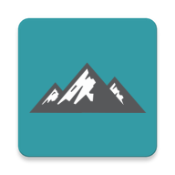
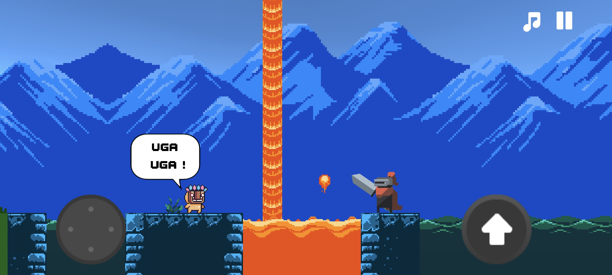
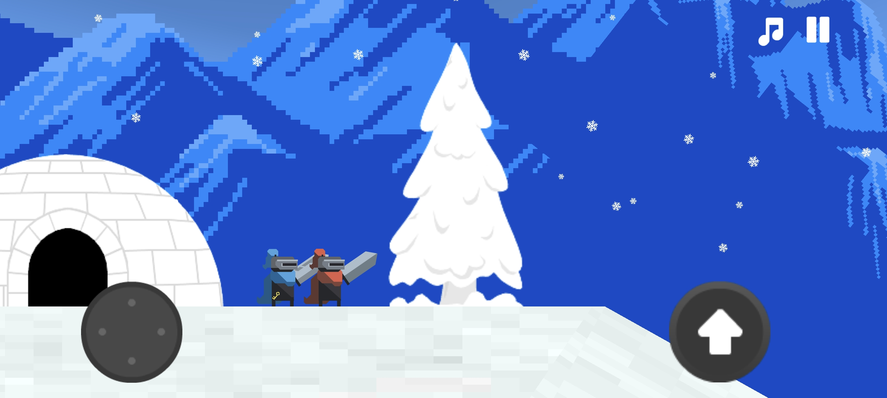
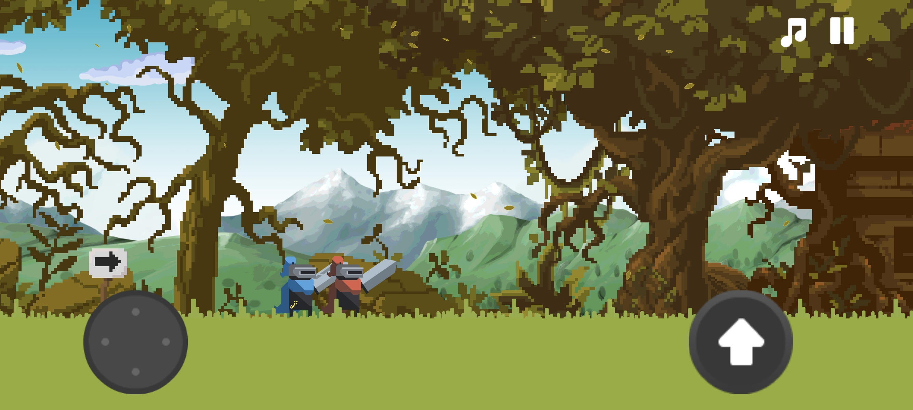

# 🎮 Knight Adventures – Game Install & Walkthrough

  

**Knight Adventures** is a retro-style 2D mobile platformer developed in 2017 using Unity. You play as a mysterious knight who sets off on a journey across villages, forests, and strange lands in search of adventure and purpose.

> 📝 *The game’s in-game text and dialogue are in **Brazilian Portuguese (PT-BR)**.*

⚠️ This is version **1.1 Beta**, the last known build of the game. The original Unity project was lost and this version is being shared for archival purposes.

## 📲 Install the Game

You can play the game by downloading and installing the APK file on your Android device:

👉 **[Download Knight Adventures v1.1 Beta](./Knight%20Adventures.apk)**

Once downloaded, install it manually on your phone. You may need to allow installation from unknown sources.

---

# 🗺️ Knight Adventures – Complete Walkthrough

Welcome to the **Knight Adventures** complete walkthrough! This guide is written in a retro style, reminiscent of classic game FAQs and walkthrough websites. Each scene is illustrated with a screenshot (`./images/X.jpg`) and described in detail, so you’ll know exactly where to go and what to do. Enjoy!  

---

## ⚔️ Game Premise
You are a mysterious knight on a quest for new adventures. Strange symbols, a helpful slime companion, and a handful of curious characters (including a king who seems to know more than he lets on) will guide you across forests, cities, mountains, and even into space!  

There are **no checkpoints**, so be cautious. If you fall into a trap, you must start over. Keep an eye out for:
- **Red Exclamation Marks (!)**: Interact with these to trigger story events.
- **Locked Doors**: Require special keys or story progression to open.
- **Slimes**: They can help you by launching you to higher places.
- **Items & Chests**: May change the course of your journey.

Let’s begin!

---

## **Start the Game** 🎮

The game opens with a dramatic **title screen**. The name *Knight Adventures* stretches across a purple twilight sky, with dark mountains and pine trees casting shadows beneath a glowing full moon.

This simple screen sets the tone for the mysterious journey ahead. Press **PLAY** to begin your quest.

---

## Scene 1: **A New Adventure** 🌟

> “You are in search of new adventures. Your goal is to explore the area and find new escape routes... Be careful!”

The game opens with this message. Tap the screen to continue. You start as a knight determined to discover hidden paths. The tone is set: danger and excitement lie ahead!

---

## Scene 2: **Home and Farewell** 🛋️

Inside a cozy house, you’re seated on a couch. Your pet slime — a loyal companion — says:  
> *“I will miss you, master.”*  

A **red exclamation mark** on the door signals an interactive event. Talk to your pet, then tap the exclamation mark to leave your home. Keep an eye out for these marks; you can interact always when there is a exclamation mark available.

---

## Scene 3: **The Cursed Mark** 🐄

Stepping outside, you see a **cow** next to a **carriage**, and towering mountains in the background. Take note of the **strange symbol** on your house’s roof — rumor has it this could be a *curse*. You can’t do anything with it just yet, so proceed to the right.

---

## Scene 4: **The Locked House** 🔒

Moving forward, you arrive at another house. It’s locked, shown by the **padlock icon** on the door. A windmill turns slowly in the distance. You’ll likely need a key or event trigger to open it. Make a mental note of this location.

---

## Scene 5: **Cabin Among the Pines** 🏡

Continuing along, you find a wooden cabin surrounded by tall pine trees. Another **red exclamation mark (!)** beckons you to investigate. Head inside to see if there’s anything important or perhaps someone you can meet.

---

## Scene 6: **The King’s Chamber** 👑

Inside, you discover a **king** resting in a modest room. A **chest** sits up high, impossible to reach for now. There are no enemies here and limited interaction. After checking around, exit the cabin.

---

## Scene 7: **The King Outside** 👀

Upon leaving, you see the king outside, quietly watching you depart. To the right of the house is a **slime** you’ll eventually need to jump on, but not yet. Instead, the path directs you back **to the left**, toward the forest behind your starting house.

---

## Scene 8: **Forest Sign** 🌲

You come across a sign pointing to the right, but **ignore** it and continue left into the thicker part of the forest. The setting becomes dense with trees. Keep going until you reach the forest’s edge.

---

## Scene 9: **The Distant Church** ⛪

At the far edge of the woods, you glimpse a **church** in the distance (visible on the horizon). Press forward. The scenery’s colors begin to shift, indicating you’re entering a **city** area.  

---

## Scene 10: **City Well** 💧

You find yourself in a small city street. A guard stands beside a **well**, remarking:  
> *“The well looks very deep...”*  

A woman lingers by an old post on the left. This city feels a bit tense. Explore freely, but your goal is to move **further left**.

---

## Scene 11: **Mining Cart** 🛻

Continuing to the left, you hop over several **wooden crates** stacked in your path. Behind the last crate is a **mine cart**. You **don’t** ride this cart; instead, you’ll **jump onto** the cart and then onto the crate to clear the obstruction. This lets you exit the city area and reach its boundary.

---

## Scene 12: **Beware the Trap** ⚠️

As you exit the city, you soon spot a **deep pit** disguised by shrubbery. If you fall, you lose everything! Carefully jump over it. A solitary **pillar** stands further ahead, hinting you’re leaving the populated areas.

---

## Scene 13: **Lava and Fire** 🔥

Cross a small watery segment, and suddenly the environment shifts to **lava**. 🏜️ A tiny **fireball** hops out, letting you know danger is real. A masked figure stands near the lava, uttering:  
> *“Uga uga!”*

Stay alert and keep moving — there are no checkpoints!

---

## Scene 14: **Snowy Mountain** ❄️

Once you pass the lava zone, the climate changes drastically to **snow**. You see flakes drifting down as you ascend a tall mountain. The transition from molten lava to frosty peaks is abrupt, so watch your step.

---

## Scene 15: **The Icy Summit** 🧊

Atop the mountain, you discover a **snow-covered tree** and a modest **igloo**. No obvious path forward, so enter the igloo — it might hide a tunnel or passage to the other side of the peak.

---

## Scene 16: **Hidden Passage** 🔍

Inside the igloo, there’s a winding path leading **left**. The corridor is dimly lit, and it feels like a secret route. Keep going; eventually, you’ll emerge deeper into the snowy domain.

---

## Scene 17: **Meeting the Blue Knight** 🗝️

You finally encounter the **blue knight**, who looks just like you except for armor color! He exclaims:  
> *“I’m so glad you found me... I’ve been lost here for weeks. Please help me...”*

He wields a **golden key** at his hip — possibly the key to that locked house. Join forces!

---

## Scene 18: **Return to the Locked House** ↩️

With the blue knight in tow, backtrack through the igloo and across the areas you visited before. Careful with traps — now you’re responsible for the safety of two knights! Your mission: reach that **locked house** with the windmill.

---

## Scene 19: **Dual Survival** 🤝

Traversing the obstacles is more tense now that the blue knight follows your lead. No special commands are needed — it’s more about staying mindful as you re-enter tricky zones like the **lava** or that **hidden trap**.

---

## Scene 20: **Finally Unlocked** 🏠

Back at the locked house, the **padlock** is replaced by an **exclamation mark**. Interact, and thanks to the blue knight’s golden key, you’re in! This new interior may hold vital clues.

---

## Scene 21: **An Eerie Bedroom** 🎹

Inside, you find a quaint **bedroom** with a **piano**. The blue knight plays a gentle tune, saying:  
> *“They say anyone who sleeps in this bed has strange dreams...”*

Approach the **bed** (exclamation mark) to lie down. You close your eyes...

---

## Scene 22: **A Slime Awakening** 🐛

You awaken, only to realize **you** have become a **slime** — much like your own pet! Meanwhile, the blue knight plays an oddly different tune on the piano. Spooked, you step outside to see what changed.

---

## Scene 23: **Crows and Darkness** 🌫️

Cawing **crows**, a **gray sky**, and a dismal atmosphere greet you. The entire world feels darker. The houses and landforms remain, but twisted. Despite the shock, your best option is to head **right** and investigate.

---

## Scene 24: **Abandoned Cabin** 🕸️

You return to the same wooden house (where you first met the king).

---

## Scene 25: **The Chest Revisited** 💼

Inside, it’s deserted. No king, no furniture... Where did everything go? The once unreachable **chest** is now directly before you. No obstacles! Interact with it to uncover the truth behind these bizarre changes.

---

## Scene 26: **Waking from the Nightmare** 💭

Opening the chest warps you back to the bedroom. The blue knight greets you:  
> *“It’s about time... Go to space and use the portal. Good luck!”*

He hints at a cosmic adventure. Unsure but determined, you leave the house.

---

## Scene 27: **Slime Boost** 🪨

Outside, you find your path blocked by a **giant boulder**. A sign points **up**, and near it is a helpful slime saying:  
> *“I’ll give you a boost. Jump on me!”*

Bounce on the slime, launching you high into the air.

---

## Scene 28: **Skyward Bound** 🕊️

Your jump catapults you beyond the clouds! Enjoy the momentary view as you soar upwards.

---

## Scene 29: **Floating Islands** 🪐

You land on an **island** suspended in midair, with another island connected by a **wooden bridge**. Some appear to the left, some to the right. Time your jumps carefully; a fall here could be fatal.

---

## Scene 30: **The King’s Spirit** 👻

On the left island, a **ghostly figure** materializes – unmistakably the **same king** you encountered earlier (back in Scene 6). Wearing his crown and sword, he hovers in the air, confirming that the house you saw empty in your dream truly belonged to him:
> *“Follow this path if you wish to complete your journey.”*

He disappears, leaving you to decide your fate.

---

## Scene 31: **Crossing the Bridge** 🌉

Heeding his words, you take the narrow wooden bridge to another platform. A small **box** rests atop it. Below, you see more land but can’t get there yet.

---

## Scene 32: **Lowering the Crate** 📦

A **ladder** leads downward to a lower platform, which you can reach on your own. However, beyond that lower platform is another ledge that's too high to climb without extra help. To fix this, **push the crate off** the edge so it falls below with you. Once you descend, you can move the crate into position and use it as a step to reach the next platform.

---

## Scene 33: **Scaling Up** 📛

Use the crate to climb onto a higher platform. A sign exclamation mark warns of **danger** ahead — get ready for some careful jumps or tricky obstacles.

---

## Scene 34: **The Grand Platform** 🧱

Leaping across, you land on a **vast floating platform** with an arrow sign pointing to the right. The horizon is now dotted with drifting rocks and swirling clouds.

---

## Scene 35: **Hidden Branch** 🌿

As you move carefully, you spot a **branch** that’s partially concealed by the scenery. Jump onto it from above to reach a final stone platform.

---

## Scene 36: **A Strange Mechanism** 🪙

Here, a **metallic platform** with another **crate** awaits. Step onto it. A sign points upward, implying you need to do something with the crate to activate the mechanism.

---

## Scene 37: **Jettison the Crate** 🚀

Push or toss the crate off the platform. Suddenly, it begins to move, carrying you through the sky and into **outer space**! 🌌

---

## Scene 38: **Crystalline Cosmos** 🔮

You arrive in a star-filled realm with a large **purple quartz** crystal glowing gently. A **staircase** extends upward, leading to who-knows-what.

---

## Scene 39: **The Portal** 🌀

At the top is an **astronaut** floating around — you can spin him if you like! Next to him is a **rotating 3D cube**, the rumored **portal**. An exclamation mark hovers above it.

---

## Scene 40: **The Grand Finale** 🎇

By entering the portal, you’re plunged into a **360-degree cosmic view** in first person. To your amazement, **your cow and carriage** drift in the void. Approach them, hit the exclamation mark, and watch the ending unfold! 🎉

---

## Scene 41: **A Journey’s End** 🔚

The screen fades in as your **carriage rolls forward**, moving slowly through a quiet forest bathed in moonlight. Trees stretch high into the night sky, and soft beams of light cut through the shadows.

Behind the carriage, your loyal **slime companion** follows closely, hopping along the path. The knight remains still, watching the road ahead.

> **END OF GAME..**  
> *Thank you for playing :)*
  
Your journey is over — but something tells you the adventure isn’t truly finished.

---

## 🐣 Easter Eggs

**Knight Adventures** is filled with mysterious details and hidden oddities. Some are visual gags, others are secret paths or references. Here are five of the most interesting Easter Eggs discovered in version 1.1 Beta:

---

### 🔫 Modern Weapon
  
At the very beginning of the game, inside the knight’s house, you can spot a **modern rifle** placed on the floor near the couch. In a world of swords, kings, and slimes, this weapon feels completely out of place — perhaps a developer joke, or a deeper hint about the knight’s past?

---

### 🌆 Retrowave City
  
If you **jump into the well** during Scene 10 (instead of just talking to the guard), you’ll fall into a strange, inescapable loop: the knight lands **inside a red car**, which then takes you to a glowing, neon-lit **retrowave city**. The environment changes completely, accompanied by a synth-heavy soundtrack. There’s no way to exit — this secret zone traps you in a different reality.

---

### ❄️ Avalanche Surprise
  
During the snowy mountain segment, you’ll encounter a **massive snowball** at the top of a slope. You can **push it**, and it will roll downhill as if triggering an avalanche. However, there’s no danger or consequence — just a fun and surprising moment that breaks expectations.

---

### 💰 Hidden Treasure
  
After using the **slime jump**, instead of going to the floating islands above, head **right** toward the giant rock that previously blocked your path. Behind it lies a **golden treasure chest**. It looks special, but you **can’t interact with it**. The platform ends there, forcing you to fall and die.

---

### ☠️ Skull Platform
  
If you **ignore the portal** and keep walking to the right instead of finishing the game, you’ll come across a **wooden mine cart** and a **skull warning sign**. Tempting, right? But if you ride the cart, it launches you across **broken rails** — sending you into the void. The punishment? You get sent **back to the very start** of the game. A cruel joke for the curious… or the greedy.

---

## 📝 Additional Tips & Notes

- **No Checkpoints**: If you die by falling into pits or traps, you must restart. Stay alert!
- **Exclamation Marks (!)**: These are the game’s main interaction points. Tap them to progress dialogue or unlock new areas.
- **Locked Doors**: Generally require a key or story event. Keep track of locked areas you can’t access yet.
- **Beta Version**: Knight Adventures v1.1 Beta doesn’t have all intended features, and some areas may feel incomplete or glitchy.

---

## ☠️ Game Over Screen

If you fall into a pit, get caught in a trap, or take the wrong path… this is what you’ll see.  
The **Game Over screen** appears with a haunting red glow, and your only option is to **restart the entire game** from the beginning.

In *Knight Adventures*, death is permanent — so every step counts.

---

## 🎉 Conclusion

That’s the full walkthrough for **Knight Adventures**! You’ve traveled from a humble wooden house, across forests and lava pits, through snowy peaks and onto floating islands, all the way into outer space. Enjoy the game, and thanks for playing!

